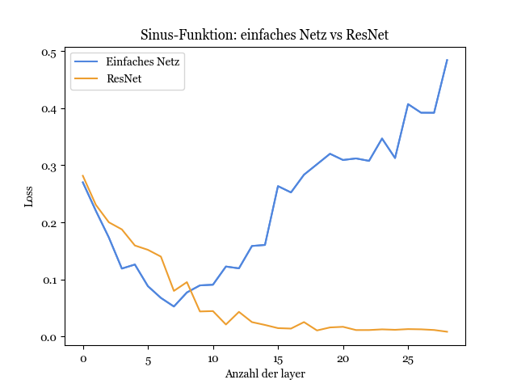
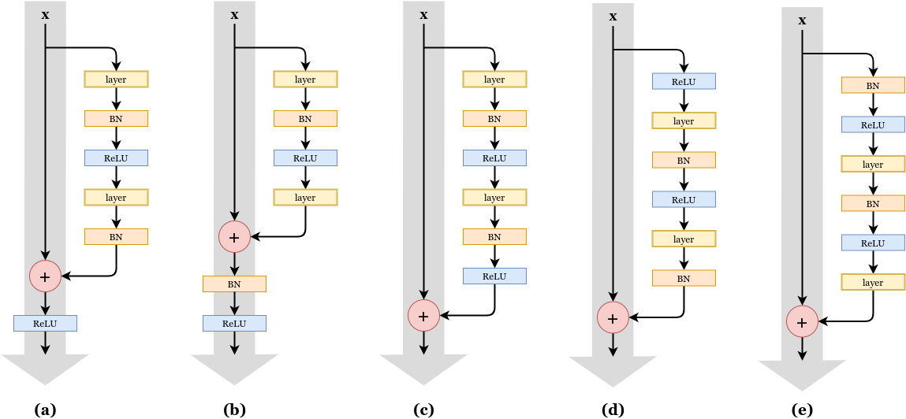
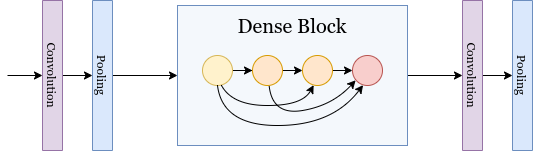

<iframe src="https://drive.google.com/file/d/188VBwWBlH7LihY3sFaKFKW8dql0YojRU/preview?resourcekey=null" height="100%" width="100%"></iframe>

## Motivation

Bei **Residual Neural Networks**, oder kurz _ResNets_, handelt es sich um eine bestimmte Art von neuronalen Netzen, die sich dadurch auszeichnen, dass sie sehr viele hidden Layer besitzen, also äußerst 'tief' sind. Dabei sind sie trotzdem noch sehr effizient trainierbar und erzielen eine hohe Performances. Besondere Anwendung finden sie im Bereich der Bildklassifikation in Verbindung mit Convolutional Neural Networks (CNNs).  
Bevor wir uns genauer anschauen, wie ResNets aussehen und funktionieren, betrachten wir zunächst das zentrale Problem, welches die Entwicklung von ResNets motiviert hat: das **Trainieren von sehr tiefen Netzen**. "Sehr tief" ist dabei im folgenden alles über ca. 25 hidden Layer. Wir schauen uns an, warum das in der Praxis normalerweise nur begrenzt möglich ist und wie ResNets das Problem lösen können.

### Wozu benötigt man _tiefe_ neuronale Netze?

Um zu verstehen, warum tiefe Netze oftmals bessere Performances liefern als weniger tiefe Netze, ist es hilfreich, sich noch einmal vor Augen zu führen, wie und warum ein tiefes neuronal Netz überhaupt funktioniert, hier mal am Beispiel von **Convolutional Neural Networks**.

{ width=100% }

Ein ConvNet besteht in der Regel aus mehrern hintereinander geschalteten convolutional Layern mit anschließenden pooling- und batch-normalization Layern. Am Ende des Netzwerkes finden sich meistens einige wenige fully-connected Layer, die beispielsweise in einem Ausgabe-Layer zur Klassifikation enden können. Die Idee für ConvNets entspringt aus den Erkenntnissen der klassischen Computergrafik, da die zu lernende Gewichte eines ConvNets die Parameter von linearen Filtern sind, die genutzt werden können, um Strukturen in einem Bild zu erkennen.

Dabei ist es so, dass die gelernten Features von Schicht zu Schicht immer abstrakter werden. Man kann es sich so vorstellen, dass die ersten Schichten lernen, Kanten und Ecken zu erkennen, weitere Schichten lernen, diese Kanten zu Texturen oder Formen zusammenzusetzen und somit Objektteile zu erkennen, und die letzten Schichten lernen, wie sich diese Objektteile zueinander verhalten und zu ganzen Objekten zusammensetzen. Dadurch wird dann Bilderkennung möglich. In der obigen Abbildung sind die einzelnen Schichten eines ConvNets, das mit dem bekannten MNIST Datensatz (handgeschriebene Ziffern) trainiert wurde, visualisiert und zeigen diesen Umstand noch einmal eindrücklich, auch wenn es nicht immer der Fall sein muss, dass diese Features visuell gut von uns Menschen interpretiert werden können.

Theoretisch ist es möglich, mit nur wenigen Layern Klassifikation lediglich anhand der ersten low-level Features wie den Kanten vorzunehmen (_'Universal approximation theorem'_), jedoch ist es praktisch nur sehr schwer umzusetzen, da dies äußerst viele Trainingsbeispiele und sehr lange Trainingszeit erfordert. Daher ist das Hinzufügen von weiteren Schichten nur sinnvoll. Es erlaubt es, auf eine effizientere Weise mehr und abstraktere (somit oft auch bessere) Features zu lernen.

Dies ist nicht nur bei Bilderkennung mit ConvNets der Fall. Neuronale Netze sind grundsätzlich **universelle Funktionsapproximatoren**. Je mehr Schichten ein neuronales Netz hat, desto einfacher ist es, immer komplexere Funktionen zu lernen und sich immer mehr der zu lernenden Idealfunktion anzunähern.

Dieser Trend, immer mehr Schichten zu benutzen um die Performance für eine bestimmte Aufgabe zu steigern, hat sich in der Vergangenheit auch gezeigt.

{ width=60% }

Betrachtet man die **ImageNet competition** bist zum Jahr 2015, so stellt man fest, dass die Architekturen mit den besten Ergebnissen von Jahr zu Jahr immer tiefer wurden. Auch an anderen Datensätzen war dies erkennbar - tiefere Netze erreichten bessere Genauigkeiten.

Mit diesen Beobachtungen könnte man schlussfolgern, dass tiefe Netze immer besser sind, also die Lösung für schlechte Performance einfach stets "mehr Layer" sein könnte. Doch dem ist im Allgemeinen jedoch nicht so.

### Das Problem mit sehr tiefen Netzen

Es hat sich herausgestellt, dass das Training von sehr tiefen Netzen, also von Netzen mit über ungefähr 25 oder 30 Schichten, Probleme bereitet und nicht mehr ohne weiteres möglich ist. Warum ist das so?

Der Hauptgrund dafür ist ein Umstand der als **'degeneration problem'** bekannt ist. Das Hinzufügen von weiteren Layern verbessert zwar zunächst die Trainierbarkeit und Performance eines Netzes, letztere erreicht erwartungsgemäß irgendwann ein gewisses Plateau, fängt jedoch ab einer gewissen Anzahl an Layern an, stark abzufallen. Das heißt, insbesondere sind bei sehr tiefen Netzen sowohl der Trainings-Error als auch der Test-Error viel höher als bei gleichen, weniger tiefen Netzen.

{ width=75% }

Als Beispiel ist hier das Lernen der Sinus-Funktion mithilfe eines einfachen feed-forward Netzes mit je 30 Knoten pro Layer dargestellt. Der Graph zeigt den Loss für unterschiedliche Anzahlen von hidden Layer. Es ist zu beobachten, dass der Loss anfänglich zwar abnimmt, je mehr Layer hinzufügt werden, doch ab 7 Layern beginnt er wieder größer zu werden und steigt konstant an. Das Netz wird ab einem bestimmten Punkt durch immer mehr Layer also nicht besser, sondern schlechter!

Eine allgemeine Erklärung für das degeneration problem könnte **Overfitting** sein. Vielleicht ist das Netz ab einem bestimmten Punkt so komplex, dass es anfängt, sich zu stark an den gegebenen Trainingsdatensatz anzupassen, ihn auswendig zu lernen oder sich zu sehr auf Rauschen in den Daten zu konzentrieren, sodass es nicht mehr gut generalisiert. Overfitting kann man hier jedoch ausschließen, da nicht nur der Test-Error, sondern auch der Trainings-Error höher ist, das Netz also noch nicht einmal die Trainingsdaten gut erfasst. Das bedeutet auch, dass weder Dropout noch andere Regularisierungsmaßnahmen gegen das degeneration problem helfen.

Eine weitere Erklärung ist das Problem von **vanishing/exploding gradients**. Da im backpropagation Schritt die Gradienten der Loss-Funktion mithilfe der Kettenregel ermittelt werden und somit bei tiefen Netzen sehr viele Terme miteinander multipliziert werden, kann das Ergebnis bei sehr kleinen Zwischenwerten äußerst klein (oder 0) und bei großen äußerst groß werden, sodass die Konvergenz behindert wird und das Training somit fehlschlägt. Dieses Problem ist tatsächlich manchmal der Grund, warum das degeneration problem auftritt, jedoch lässt sich zeigen, dass selbst durch Nutzung von batch normalization und Ausschließen von vanishing/exploding gradients das degeneration problem in der Praxis trotzdem weiterhin auftritt1.

{ width=65% }

Es hat stattdessen viel mehr mit dem **Optimierungsmechanismus** zu tun, und damit, wie die **Parameter initialisiert** werden. Theoretisch sollte es nämlich so sein, dass ein tieferes Netz B mit n Layern wenigstens genau so gute Ergebnisse erzielt wie ein gleiches, nur weniger tiefes Netz A mit m < n Layern. Dies kann man sich auf folgende Weise klarmachen: das tiefere Netz B könnte in seinen ersten Layern das gleiche lernen wie A, somit wären die ersten m Layer die gleichen wie bei A. Bei allen folgenden Layern würde B die Identitätsfunktion lernen und damit die exakt gleichen Ergebnisse liefern wie A.

Doch ganau hier liegt das Problem - es ist in der Regel nur sehr schwierig, die Identität zu lernen. Bei der Initialisierung werden die Parameter nämlich in der Regel aus einer Gaußverteilung mit Mittelwert 0 gezogen. Das heißt, für einen 'solver', also Lösealgorithmus, ist es relativ einfach, die Nullfunktion anzunähern, da die Parameter bereits am Anfang nahe um die 0 verteilt sind. Es ist für ihn jedoch schwer, die Identität zu lernen, genauer gesagt genauso schwer wie jede andere Funktion.  
Ein Beispiel: bei einem 3x3 linearen Filter wäre die Identitätsfunktion

{ width=20% }

damit müssen alle 9 Gewichte richtig gelernt werden. Ein solver findet in der gegebenen Trainingszeit und mit den vorhanden Trainingsdaten somit meistens keinen Weg dazu, auch weil die Anzahl der Parameter zu groß wird. Dadurch entstehen durch mehr Layer auch solche Layer, die der Performance des gesamten Netzes schaden, anstatt sie zu verbessern.

Genau hier setzen die Residual Networks an und bieten eine Lösung für eben dieses Problem.

## Residual Networks

### Das Lernen von Residuen

Die Idee, die es ermöglicht, einfacher die Identitätsfunktion zu lernen, ist folgende: Anstatt zu hoffen, dass alle paar hintereinander geschaltete Layer eine zugrunde liegende Funktion direkt approximieren, werden bei ResNets in den Layern nur die **Residuen** der Eingabe in dieses Layer zu der Idealfunktion explizit gelernt, daher auch der Name _Residual Networks_. Was genau bedeutet das?

Noch einmal zur Erinnerung: der Begriff _Residuum_ bezeichnet die Abweichung eines Datenpunktes von dem vom Modell geschätzten Wert. Im Beispiel von linearer Reagression im R2 wäre dies der vertikale Abstand eines Punktes zur geschätzten Regressionsgerade.

Betrachten wir uns einige hintereinander geschaltete Layer eines feed-foward Netzwerkes. Sei _x_ dabei die Eingabe in diese Layer und _H(x)_ die zugrunde liegende Funktion, die von diesen Layern gefitted werden soll. Anstatt diese Layer direkt _H(x)_ approximieren zu lassen, lernen die Layer in ResNets die Restfunktion **_F(x) = H(x) - x_**, also lediglich die Abweichung der Idealfunktion von der Eingabe _x_, umgeschrieben ist die Idealfunktion also _H(x) = x + F(x)_. Beide Ansätze approximieren asymptotisch die gewünschte Funktion, jedoch hat sich herausgestellt, dass das Lernen von Residuen einfacher zu sein scheint und eine Reihe von Vorteilen mit sich bringt1.

Der Hauptgrund dafür wird ersichtlich, wenn wir uns die Motivation für ResNets noch einmal anschauen. Es ist wie in den obigen Kapiteln beschrieben natürlich wünschenswert, wenn ein tiefes Netz wenigstens genauso gut ist wie ein weniger tiefes, gleich aufgebautes Netz. In der Praxis kommt jedoch das degeneration problem dazwischen, und ein Hauptgrund dafür ist, dass die Identitätsfunktion normalerweise nur schwer gelernt werden kann.

{ width=70% }

Mit der **Reformulierung des Lernprozesses** zu dem Lernen von Residuen wird dieses Problem nun jedoch gelöst. Wenn die Identitätsfunktion die optimale Funktion für die betrachteten Schichten ist, kann der solver die Gewichte von _F(x)_ relativ einfach gegen 0 steuern, da sie ohnehin wie oben besprochen bereits relativ nah um die 0 herum verteilt sind, sodass _F(x) = 0_ wird. Somit wird mit H(x) = 0 + x = x die gewünschte Identitätsfunktion erreicht. Die Eingabe in die Layer wird einfach unverändert an hintere Layer weitergereicht. Und wenn _H(x)_ nicht die Identiät ist, lernen die Layer mit _F(x)_ eben alles nötige "was _x_ noch fehlt" um _H(x)_ zu approximieren.

Doch wie genau wird dies in einem ResNet umgesetzt und wie sieht ein ResNet überhaupt aus?

### Aufbau eines ResNets

{ width=45% }

Ein **ResNet** besteht aus einer Reihe von hintereinander geschalteten **ResNet-Blöcken** (s. Abbildung oben). Ein ResNet-Block umfasst typischerweise zwei bis drei normale hidden Layer, das könnten beispielsweise zwei convolutional Layer mit anschließenden pooling und batch-normalization Layern sein wie im Beispiel unten. Es müssen mindestens zwei sein, da sie sich ansonsten nicht von normalen linearen Netzen unterscheiden würden. Das besondere an ResNets sind jedoch die sogenannten 'shortcut-' oder **'skip-connections'**, welche die Eingabe in die Layer weiter nach vorne transportieren wo diese zu der Ausgabe aufaddiert werden, in der Regel noch bevor die Aktivierungsfunktion angewandt wird.

Formal gesehen ist ein ResNet Block _y_ also definiert als

_y = F(x, {Wi}) + Ws\ * x_,

wobei _F(x ,{Wi})_ die von den Layern zu lernende Residualfunktion parametrisiert mit Gewichten _Wi_ darstellt und _x_ die Eingabe in die Layer bezeichnen. Somit approximiert der gesamte Block die Idealfunktion _H(x)_, also _y ≈ H(x)_.

{ width=60% }

Da die Dimension der Eingabe nicht unbedingt der Dimension der Ausgabe der Layer entsprechen muss, zum Beispiel weil convolutions und pooling angewandt wurden, muss die Eingabe _x_ in diesem Fall auf die Dimension der Ausgabe gebracht werden, dies wird durch die lineare Projektion _Ws_ erreicht. In der Praxis werden dafür oft Padding-Methoden genutzt, jedoch haben sich **1x1 convolutions** als gängige Methode durchgesetzt1.

Ansonsten besitzen die skip-connections bei klassischen ResNets keine weiteren Parameter, die gelernt werden müssten, sodass durch Setzen der Gewichte _Wi_ auf 0 der Block tatsächlich die Identitätsfunktion annähert.

Viele bekannte Deep Learning Bibliotheken wie Tensorflow und PyTorch enthalten oftmals vorimplementierte ResNet Architekturen. Möchte man jedoch ein ResNet von Grund auf selbst schreiben, ist hier mal eine Beispielimplementierung eines ResNet-Blocks in PyTorch vorgestellt. Diese Blöcke können dann hintereinander gesetzt werden, um ein ResNet zu bauen:

<!-- HTML generated using hilite.me -->
<table><tr><td><pre style="margin: 0; line-height: 125%"> 1
 2
 3
 4
 5
 6
 7
 8
 9
10
11
12
13
14
15
16
17</pre></td><td><pre style="margin: 0; line-height: 125%">class ResidualBlock(nn.Module):
    def __init__(self, in_channels, out_channels):
        super().__init__()
        self.in_channels, self.out_channels =  in_channels, out_channels
        self.blocks = nn.Identity()
        self.shortcut = nn.Identity()

    def forward(self, x):
        residual = x
        if self.should_apply_shortcut: residual = self.shortcut(x)
        x = self.blocks(x)
        x += residual
        return x

    @property
    def should_apply_shortcut(self):
        return self.in_channels != self.out_channels
</pre></td></tr></table>

Die folgende Abbildung stellt das durch das Original-Paper bekannt gewordene **152-layer ResNet** in den Vergleich zum prominenten VGG-19 Netz. Die gestrichelten skip-connections im rechten Bild kennzeichnen dabei 1x1 convolutions zur Anpassung der Dimensionen.

{ width=55% }

### Performanz von ResNets

Betrachten wir noch einmal das Beispiel aus dem Kapitel über das degeneration problem, dem Lernen der Sinus-Funktion. Nutzt man nun das genau gleiche Netzwerk, fügt jedoch eine skip-connection ohne Gewichte über alle drei Layer ein, so beobachtet man ein ganz anderes erstaunliches Ergebnis. Der Loss nimmt immer weiter ab und bleibt unten, auch bei einer großen Anzahl an Layern! Es scheint, als würde das Netzwerk mit jeder weiteren Schicht tendenziell besser werden.

{ width=75% }

Und tatsächlich sind sehr tiefe ResNets im Allgemeinen ziemlich effizient trainierbar und erzielen gute Resultate. Wie in der obigen Abbildung zu erkennen scheinen ResNets nicht vom degeneration problem betroffen zu sein. Das Hinzufügen von mehr Layern führt tatsächlich zu einem **niedrigeren Fehler und besserer Performance**, sowohl auf den Trainings- als auch auf den Testdaten. Tiefe ResNets erweisen sich als mindestens genauso gut und sogar besser als weniger tiefe, alle zusätzlichen Layer nutzen scheinbar ihr Potential, die Performance zu verbessern.

{ width=60% }

Wie in der Abbildung zu erkennen, gewannen ResNets mit dem berühmten ResNet-152 die **ImageNet comepetition** im Jahre 2015 mit einem Fehler von nur 3.57% und lösten damit das bis dahin beste GoogLeNet mit einem Fehler von 6.7% und 22 Schichten deutlich ab. Interessanterweise hatte das ResNet-152 viel weniger Parameter als die anderen Wettbewerber und war somit auch schneller trainierbar, jedoch mit 152 Schichten sehr viel tiefer. Mehr dazu findet sich im übernächsten Kapitel zum Training von ResNets.

Seitdem konnten Architekturen von **über 1000 Layern** erfolgreich trainiert werden, und im sehr theoretischen Umfeld auch Netze mit 2000+ Layern7, sie werden in der Praxis jedoch nicht wirklich eingesetzt, da sie eher unpraktikabel sind. Denn auch ResNets haben ihre Grenzen. Ab einem bestimmten Punkt läuft man nämlich auch Gefahr, die **Trainingsdaten zu overfitten**, sodass die Performance auch bei ResNets irgendwann abnimmt und mehr Layer nicht mehr nützlich, sondern eher schädlich werden. Desweiteren erhöht sich mit jedem Layer natürlich auch die Anzahl an Parametern, sodass das Training immer länger dauert und immer schwieriger wird.

### Warum genau funktioniert das nochmal?

Zum einen sind die guten Performances von ResNets auf den Umstand zurückzuführen, dass das **Lernen von Residuen** scheinbar grundsätzlich einfacher zu sein scheint, als das direkte Approximieren einer Zielfunktion. Damit lassen sich auch sehr viel einfacher **Identitätsfunktionen** lernen, sodass es einem größeren Netz die Möglichkeit gibt, wenigstens genauso gut zu sein wie ein gleiches kleineres. Layer, die der Performance nur schaden, können einfach übersprungen werden, indem die Eingabe in diese Layer unverändert an hintere Layer weitergereicht wird. Dies geschieht auch ganz natürlich und dynamisch durch backpropagation, man braucht keinen zusätzlichen Hyperparameter für die Anzahl der Layer hinzuzufügen.

Dadurch, dass gewisse Layer einfach übersprungen werden können, ähnelt das Training von ResNets dem **Training eines Ensembles**. Es erlaubt es, unterschiedliche Teile des Netzwerks zu unterschiedlichen Zeiten und Raten zu trainieren, abhängig davon, wie der Error im Netz zurückpropagiert wird. Somit können durch bestimmte Trainingsbeispiele auf natürliche Weise gezielt Teile des Netzes trainiert werden.

Da nur Residuen gelernt werden, geschieht im Prinzip lediglich ein **fine-tuning der Eingabe** in einen ResNet Block. Er wird von jedem Layer nur ein Stück weit angepasst, um näher an die zu lernende Idealfunktion zu kommen. Die erwartete Ausgabe muss somit nicht 'von scratch' generiert werden. Dies erklärt auch, warum das Hinzufügen von Layern die Performance noch weiter erhöht: der Input wird mit jedem Layer immer ein ganz kleines Stück verbessert - zumindest solange, bis man beispielsweise an Overfitting stößt.

### Training von ResNets

Schauen wir uns nun an, wie genau das Training von ResNets aussieht. Der Vorteil bei ResNets gegenüber anderen Netzwerk-Architekturen ist, dass ResNets zwar mehr Layer besitzen, jedoch **sehr viel weniger Parameter**. Das end-to-end Training verkürzt sich dadurch mit normalen Verfahren oft trotz der höheren Anzahl an Layern.

Vergleichen wir zum Beispiel mal das ResNet-152 mit dem VGG-16 (ein grafischer Vergleich mit dem VGG-19 ist in "Aufbau eines ResNets" zu finden). Das VGG-16 besteht aus mehr als 143,6 Millionen Parametern, während das ResNet-152 nur 11,5 Millionen Parameter besitzt. Auch bei der Komplexität gibt es einen großen Unterschied. In dem Original-Paper zu ResNets geben die Autoren für das VGG-19 19,6 Milliarden FLOPs an, während ihr 34-layer Basisnetz mit nur 3,6 Milliarden FLOPs auskommt, also nur 18% des VGG-191!

Das funktioniert auch deswegen besonders gut, da sich bei reinen ResNets nichts grundlegendes bei den foward- und backward-propagation Schritten ändert, die skip connections sind im Prinzip die einzige Änderung. Da diese in der Regel jedoch keine eigenen Parameter besitzen, können ResNets also ganz normal mit herkömmlichen backpropagation Verfahren trainiert werden. Das Training wird zusätzlich auch dadurch verbessert, dass die Gradienten über die skip connections nun viel besser zu vorigen Layern fließen können. Dies hilft unter anderem auch bei dem vanishing/exploding gradients Problem.

### Andere Varianten von ResNets

Seit der Entwicklung von ResNets hat es mittlerweile viele Ansätze gegeben, die anfängliche Architektur zu verbessern und weitere, auf den einfachen ResNets aufbauende Netzwerkstrukturen zu entwickeln.

{ width=90% }

Zum einen wurde untersucht, wie viele Layer man am besten überspringt und welchen Einfluss die Reihenfolge der einzelnen Elemente in einem ResNet-Block auf die Performance hat2. Zum Beispiel könnte man den batch-normalizaion Layer nach der Addition mit dem 'skip'-Wert platzieren (b), oder die Aktivierungsfunktion schon vor der Addition anwenden (c), oder sie am Ende des Blockes komplett weglassen und stattdessen an den Anfang zu setzen (d). Die Autoren des entsprechenden Papers fanden heraus, dass im Allgemeinen die Anordnung in **(e)** besonders bei sehr tiefen Netzen (~1000 Schichten) die besten Resultate liefert.

{ width=70% }

Zum anderen wurden die Ideen in ResNets auch übernommen, um weitere vergleichbare Architekturen zu entwerfen. **DenseNets**4 zum Beispiel führen statt nur einer skip-connection in einem Layer Block Verbindungen von allen vorangehenden Layern zu allen folgenden Layern ein, daher der Name _dense_. Dabei werden viele dieser Blöcke wie bei ResNets auch hinterinander geschaltet. Der Vorteil ist, dass dadurch noch weniger Parameter gelernt werden müssen und die Gradienten noch besser propagiert werden können, was oft zu besseren Resultaten als bei ResNets führt.

Zwei weitere prominente Architekturen, die gewissermaßen auf ResNets aufbauen, sind **HighwayNets**5 und **ResNeXt**6. Erstere führen für die skip-connections eigene Parameter ein, welche lernen, zu welchem Ausmaße die Eingaben durch die skip-connections oder durch den primären Weg weiterpropagiert werden. Die Struktur ähnelt gewissermaßen den gates in LSTMs. _ResNeXt_ Netze verfolgen dagegen den Ansatz, statt dem Hintereinanderschalten von einzelnen ResNet-Blöcken, stattdessen etliche solcher Blöcke parallel zu einem größeren, 'weiten' Block zu schalten und dann diese größeren Blöcke hintereinander zu setzen. Beide Ansätze kommen mit ihren Vor- und Nachteilen und können bei bestimmten Problemen jeweils bessere Ergebnisse erzielen.

## Zusammenfassung

**ResNets** erlauben es, sehr tiefe Netze zu trainieren. Tiefere Netze ermöglichen es oftmals, effizienter komplexe Funktionen zu lernen und führen somit häufig zu besseren Ergebnissen. Da einfache Netze wegen des _degeneration problems_ nicht besonders tief sein können, formulieren ResNets das Lernproblem dazu um, in mehreren Layer Blöcken **Residuen von Eingaben** zu einer gewünschten Idealfunktion zu lernen, anstatt letztere direkt mit dem Block zu approximieren. Das erlaubt es, relativ einfach die _Identitätsfunktion_ zu lernen, sodass das Hinzufügen von mehr Layern die Performance nicht verschlechtert, sondern im Bestfall etwas mehr verbessert. Umgesetzt wird das ganze über **skip-connections**, also dem Weitergeben der Ausgabe eines Layers an weiter hinten liegende Layer.

Weil ResNets damit besonders erfolgreich waren, vor allem zur der Zeit als sie entwickelt wurden, wurden und werden sie häufig im Zusammenhang mit Bilderkennung genutzt, wo sie große Durchbrüche erzielen konnten. Mit der Zeit entstanden immer mehr Architekturen, die auf ResNets aufbauen, wie zum Beispiel _HighwayNets_, _DenseNets_ oder _ResNeXt_.

Doch auch ResNets haben ihre Grenzen, und man kommt ab einem gewissen Punkt zum _overfitting_ Problem. Daher sollte man in der Praxis stets die Architektur wählen, die sich am besten für ein gegebenes konkretes Problem eignet.

   
   

---

### Referenzen

1 Kaiming He, Xiangyu Zhang, Shaoqing Ren, Jian Sun (2016), **Deep Residual Learning for Image Recognition**, _IEEE_, 12. December 

2 Kaiming He, Xiangyu Zhang, Shaoqing Ren, Jian Sun (2016), **Identity Mappings in Deep Residual Networks**. In: _Leibe B., Matas J., Sebe N., Welling M. (eds) Computer Vision_, ECCV 2016

3 Mohammad Sadegh Ebrahimi, Hossein Karkeh Abadi (2018), **Study of Residual Networks for Image Recognition**, _arXiv:1805.00325_, 21. April 2018

4 Gao Huang, Zhuang Liu, Laurens van der Maaten, Kilian Q. Weinberger (2017), **Densely Connected Convolutional Networks**, _2017 IEEE Conference on Computer Vision and Pattern Recognition (CVPR)_, 2017, pp. 2261-2269

5 Rupesh Kumar Srivastava, Klaus Greff, Jürgen Schmidhuber (2015), **Highway Networks**, _arXiv:1505.00387_, 03. November 2015

6 Saining Xie; Ross Girshick; Piotr Dollár; Zhuowen Tu; Kaiming He (2017), **Aggregated Residual Transformations for Deep Neural Networks**, _2017 IEEE Conference on Computer Vision and Pattern Recognition (CVPR)_, 2017, pp. 5987-5995

7 Ionut Cosmin Duta, Li Liu, Fan Zhu, Ling Shao (2020), **Improved Residual Networks for Image and Video Recognition**, arXiv:2004.04989v1, 10. April 2020

  
