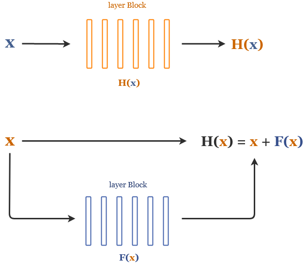
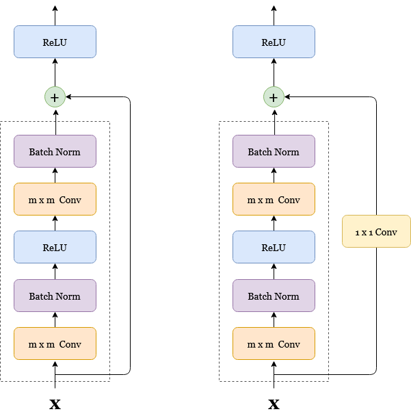

% Residual Neural Networks
% Alexander Kowsik
% 05.01.2021

<iframe src="https://drive.google.com/file/d/1lWTWhwSrc8Gqd-9N4KbeXVkC3J0RkWnk/preview" height="100%" width="100%"></iframe>

#### Momentan sind noch nicht alle Grafiken urheberrechtsfrei! Auch sind einige der Grafiken nur schnell von Hand als Idee erstellt worden und werden überarbeitet. Das werde ich demnächst noch ändern.

## Motivation

Bei **Residual Neural Networks**, oder kurz _ResNets_, handelt es sich um eine bestimmte Art von neuronalen Netzen, die sich dadurch auszeichnen, dass sie sehr viele hidden layer besitzen, also äußerst 'tief' sind. Dabei sind sie trotzdem noch sehr effizient trainierbar und erzielen hohe Performances. Besondere Anwendung finden sie im Bereich der Bildklassifikation in Verbindung mit Convolutional Neural Networks (CNNs).  
Bevor wir uns genauer anschauen, wie ResNets aussehen und funktionieren, betrachten wir zunächst das zentrale Problem, welches die Entwicklung von ResNets motiviert hat: das **Trainieren von sehr tiefen Netzen**. "Sehr tief" ist dabei im folgenden alles über ca. 25 hidden layer. Wir schauen uns an, warum das in der Praxis normalerweise nur begrenzt möglich ist und wie ResNets das Problem lösen können.

### Warum möchte man _tiefe_ neuronale Netze?

Um zu verstehen, warum tiefe Netze oftmals bessere Performance liefern als weniger tiefe Netze, ist es hilfreich, sich noch einmal vor Augen zu führen, wie und warum ein neuronal Netz überhaupt funktioniert, hier mal am Beispiel von **Convolutional Neural Networks**.

Ein ConvNet besteht in der Regel aus mehrern hintereinander geschalteten convolutional layern mit anschließenden pooling- und batch-normalization layern. Am Ende des Netzwerkes finden sich meistens einige wenige fully-connected layer, die beispielsweise in einem Ausgabe-layer zur Klassifikation enden können. Die Idee für ConvNets entspringt aus den Erkenntnissen aus der klassischen Computergrafik, da die zu lernende Gewichte eines ConvNets die Parameter von linearen Filtern sind, die genutzt werden können, um Strukturen in einem Bild zu erkennen.

Dabei ist es so, dass die gelernten features von Schicht zu Schicht immer abstrakter werden. Man kann es sich so vorstellen, dass die ersten layer lernen, Kanten und Ecken zu erkennen, weitere layer lernen, diese Kanten zu Texturen oder Formen zusammenzusetzen und somit Objektteile zu erkennen, und die letzten Schichten lernen, wie sich diese Objektteile zueinander verhalten und zu ganzen Objekten zusammensetzen. Dadurch wird dann Bilderkennung möglich. In der obigen Abbildung sind die einzelnen Schichten eines ConvNets visualisiert und zeigen diesen Umstand noch einmal eindrücklich, auch wenn es nicht immer der Fall sein muss, dass diese features visuell gut von uns Menschen interpretiert werden können.

Theoretisch ist es möglich, mit nur wenigen layern Klassifikation lediglich anhand der ersten low level features wie den Kanten vorzunehmen, jedoch ist es praktisch nur sehr schwer umzusetzen, da dies extrem viele Trainingsbeispiele und sehr lange Trainingszeit erfordert. Daher ist das Hinzufügen von weiteren layern nur sinnvoll. Es erlaubt es, auf eine effizientere Weise mehr und abstraktere (somit auch bessere) features zu lernen.

Dies ist nicht nur bei Bilderkennung mit ConvNets der Fall. Neuronale Netze sind **universelle Funktionsapproximatoren**. Je mehr layer ein neuronales Netz hat, desto einfacher ist es, immer komplexere Funktionen zu lernen und sich immer mehr der zu lernenden Idealfunktion anzunähern.

Dieser Trend, immer mehr layer zu benutzen um die Performance für eine bestimmte Aufgabe zu steigern, hat sich in der Vergangenheit auch gezeigt.

{ width=80% }

Betrachtet man die **ImageNet competition** bist zum Jahr 2015, so stellt man fest, dass die Architekturen mit den besten Ergebnissen von Jahr zu Jahr immer tiefer wurden. Auch an anderen Datensätzen war dies erkennbar - tiefere Netze erreichten bessere Genauigkeiten.

Mit diesen Beobachtungen könnte man schlussfolgern, dass tiefe Netze immer besser sind, also die Lösung für schlechte Performance einfach stets "mehr layer" sein könnte. Doch dem ist leider im Allgmeinen nicht so.

### Das Problem mit sehr tiefen Netzen

Es hat sich herausgestellt, dass das Training von sehr tiefen Netzen, also von Netzen mit über ungefähr 25 oder 30 layern, Probleme bereitet und nicht mehr ohne weiteres möglich ist. Warum ist das so?

Der Hauptgrund dafür ist ein Umstand der als **'degeneration problem'** bekannt ist. Das Hinzufügen von weiteren layern verbessert zwar zunächst die Trainierbarkeit und Performance eines Netzes, letztere erreicht erwartungsgemäß irgendwann ein gewisses Plateau, fängt jedoch ab einem bestimmten Punkt an, stark abzufallen. Das heißt, insbesondere sind bei sehr tiefen Netzen sowohl der Trainings Error als auch der Test Error viel höher als bei gleichen, weniger tiefen Netzen.

Eine Erklärung dafür könnte **Overfitting** ist. Vielleicht ist das Netz ab einem bestimmten Punkt so komplex, dass es anfängt, sich zu stark an den gegebenen Trainingsdatensatz anzupassen, ihn auswendig zu lernen oder sich zu sehr auf Rauschen in den Daten zu konzentrieren, sodass es nicht mehr gut generalisiert. Overfitting kann man hier jedoch ausschließen, da nicht nur der Test Error, sondern auch der Trainings Error höher ist, das Netz also noch nicht einmal die Trainingsdaten gut erfasst. Das bedeutet auch, dass weder Dropout noch andere Regularisierungsmaßnahmen gegen das degeneration problem helfen.

Eine weitere Erklärung ist das Problem von **vanishing und exploding gradients**. Da im backpropagation Schritt die Gradienten der loss Funktion mithilfe die Kettenregel ermittelt werden und somit bei tiefen Netzen sehr viele Terme miteinander multipliziert werden, kann das Ergebnis bei sehr kleinen Zwischenwerten sehr klein (oder 0) und bei großen sehr groß werden, sodass die Konvergenz behindert wird und das Training somit fehlschlägt. Dieses Problem ist tatsächlich manchmal der Grund, warum das degeneration problem auftritt, jedoch lässt sich zeigen, dass selbst durch Nutzung von batch normalization und Ausschließen von vanishing/exploding gradients das degeneration problem in der Praxis trotzdem noch auftritt.

{ width=65% }

Es hat stattdessen viel mehr mit dem **Optimierungsmechanismus** zu tun, und damit, wie das **Netzwerk initialisiert** wird. Theoretisch sollte es nämlich so sein, dass ein tieferes Netz A mit n layern wenigstens genau so gute Ergebnisse erzielt wie ein gleiches, nur weniger tiefes Netz B mit m layern. Dies kann man sich auf folgende Weise klarmachen: das tiefere Netz A könnte in seinen ersten layern das gleiche lernen wie B, somit wären die ersten m layer die gleichen wie bei B. Bei allen folgenden layern könnte A die Identitätsfunktion lernen und würde damit die exakt gleichen Ergebnisse liefern wie B.

Doch ganau hier liegt das Problem - **die Identität zu lernen ist in der Regel nur sehr schwierig**. Bei der Initialisierung werden die Parameter nämlich in der Regel aus einer Gaußverteilung mit Mittelwert 0 gezogen. Das heißt, für einen 'solver', also Lösealgorithmus, ist es relativ einfach, die Nullfunktion anzunähern, da die Parameter bereits relativ nahe um die 0 verteilt sind. Es ist für ihn jedoch schwer, die Identität zu lernen, genauer gesagt genauso schwer wie jede andere Funktion.  
Ein Beispiel: bei einem linearen Filter wäre die Identitätsfunktion

{ width=20% }

damit müssen alle 9 Gewichte richtig gelernt werden. Ein solver findet in der gegebenen Trainingszeit und mit den vorhanden Trainingsdaten somit meistens keinen Weg dazu. Somit entstehen durch mehr layer auch solche layer, die der Performance des gesamten Netzes schaden, anstatt sie zu verbessern.

Genau hier setzen die Residual Networks an und bieten eine Lösung für eben dieses Problem.

## Residual Networks

### Das Lernen von Residuen

Die Idee, die ermöglicht, einfacher die Identitätsfunktion zu lernen, ist folgende: anstatt zu hoffen, dass alle paar hintereinander geschaltetete layer eine zugrunde liegende Funktion direkt approximieren, werden bei ResNets in den layern nur die **Residuen** zu der Eingabe in dieses layer explizit gelernt, daher auch der Name _Residual Networks_. Was genau bedeutet das?

Noch einmal zur Erinnerung: der Begriff _Residuum_ bezeichnet die Abweichung eines Datenpunktes von dem vom Modell geschätzten Wert. Im Beispiel von linearer Reagression im R2 wäre dies der vertikale Abstand eines Punktes zur geschätzten Regressionsgerade.

Betrachten wir uns einige hinterinander geschaltete layer eines feed-foward Netzes. Sei _x_ dabei die Eingabe in diese layer und _H(x)_ die zugrunde liegende Funktion, die von diesen layern gefitted werden soll. Anstatt diese layer direkt _H(x)_ approximieren zu lassen, lernen die layer in ResNets die Restfunktion **_F(x) = H(x) - x_**, also lediglich die Abweichung der Eingabe _x_ von der Idealfunktion, umgeschrieben _H(x) = x + F(x)_. Beide Ansätze approximieren asymptotisch die gewünschte Funktion, jedoch hat sich herausgestellt, dass das Lernen von Residuen einfacher zu sein scheint und eine Reihe Vorteile mit sich bringt.

{ width=70% }

Der Hauptgrund dafür wird ersichtlich, wenn wir uns die Motivation für ResNets noch einmal anschauen. Es ist wie in den obigen Kapiteln beschrieben natürlich wünschenswert, wenn ein tiefes Netz wenigstens genauso gut ist wie ein weniger tiefes, gleich aufgebautes Netz. In der Praxis kommt jedoch das degeneration problem dazwischen, und ein Hauptgrund dafür ist, dass die Identitätsfunktion normalerweise nur schwer gelernt werden kann.

Mit der **Reformulierung des Lernprozesses** zu dem Lernen von Residuen wird dieses Problem nun jedoch gelöst. Wenn die Identitätsfunktion die optimale Funktion für die betrachteten layer ist, kann der solver die Gewichte von _F(x)_ relativ einfach gegen 0 steuern, da sie ohnehin bereits relativ nah um die 0 herum verteilt sind, sodass _F(x) = 0_ wird. Somit wird mit H(x) = 0 + x = x die gewünschte Identitätsfunktion erreicht. Die Eingabe in die layer wird einfach unverändert an hintere layer weitergereicht. Und wenn _H(x)_ nicht die Identiät ist, lernen die layer mit _F(x)_ eben alles nötige "was _x_ noch fehlt" um _H(x)_ zu approximieren.

Doch wie genau wird dies in einem ResNet umgesetzt und wie sieht ein ResNet überhaupt aus?

### Aufbau eines ResNets

{ width=65% }

Ein **ResNet** besteht aus einer Reihe von hintereinander geschalteten **ResNet-Blöcken** (s. Abbildung oben). Ein ResNet-Block umfasst typischerweise zwei bis drei normale hidden layer, das könnten beispielsweise zwei Convolutional layer mit anschließenden pooling und batch normalization layern sein wie im Beispiel unten. Es müssen mindestens zwei sein, da sie sich ansonsten nicht von normalen linearen Netzen unterscheiden würden (s. unten). Das besondere an ResNets sind jedoch die sogenannten 'shortcut-' oder **'skip-connections'**, welche die Eingabe in die layer weiter nach vorne transportieren wo diese zu der Ausgabe aufaddiert werden, in der Regel noch bevor die Aktivierungsfunktion angewandt wird.

{ width=65% }

Formal gesehen ist ein ResNet Block _y_ definiert als

_y = F(x, {Wi}) + Ws\*x_,

wobei _F(x ,{Wi})_ die von den layern zu lernende Resdiualfunktion parametrisiert mit Gewichten _Wi_ darstellt und _x_ die Eingabe in die layer bezeichnen. Somit approximiert der gesamte Block die Idealfunktion _H(x)_, also _y ~= H(x)_.

Da die Dimension der Eingabe nicht unbedingt der Dimension der Ausgabe der layer entsprechen muss, zum Beispiel weil convolutions und pooling angewandt wurden, muss die Eingabe _x_ in diesem Fall auf die Dimension der Ausgabe gebracht werden, dies wird durch die lineare Projektion _Ws_ erreicht. In der Praxis werden dafür oft Padding-Methoden genutzt, jedoch haben sich **1x1 convolutions** als gängige Methode durchgesetzt.

Ansonsten besitzen die skip-connections bei klassischen ResNets keine weiteren Parameter die gelernt werden müssten, sodass durch Setzen der Gewichte _Wi_ auf 0 der Block tatsächlich die Identitätsfunktion nähert.

{ height=65% }

Hier mal das durch das Original-Paper bekannt gewordene **152-layer ResNet** im Vergleich zum prominenten VGG-19 Netz. Die gestrichelten skip-connections im rechten Bild kennzeichnen dabei 1x1 convolutions zur Anpassung der Dimensionen.

### Performances von ResNets

Und tatsächlich sind sehr tiefe ResNets ziemlich effizient trainierbar und erzielen gute Resultate. Wie in der obigen Abbildung zu erkennen scheinen ResNets nicht vom degeneration problem betroffen zu sein. Das Hinzufügen von mehr layern führt tatsächlich zu einem niedrigeren Fehler und besserer Performance, sowohl auf den Trainings- als auch auf den Testdaten. Tiefe ResNets scheinen mindestens genauso gut und besser zu sein wie weniger tiefe, alle zusätzlichen layer nutzen scheinbar ihr Potential, die Performance zu verbessern.

Wie in Abbildung X zu erkannen, gewannen ResNets mit dem berühmten ResNet-152 die ImageNet comepetition im Jahre 2015 mit einem Fehler von nur 3.57% und lösten damit das bis daher beste GoogLeNet mit einem Fehler von 6.7% und 22 layern deutlich ab. Interessanterweise hatte das ResNet-152 viel weniger Parameter als die anderen Wettbewerber und somit auch schneller trainierbar, war jedoch mit 152 layern sehr viel tiefer. Mehr dazu findet sich im übernächsten Kapitel zum Training von ResNets.

Seit dem konnten Architekturen von über 1000 layern erfolgreich trainiert werden, und im sehr theoretischen Umfeld auch Netze mit 2000+ layern, sie werden in der Praxis jedoch nicht wirklich eingesetzt, da sie viel zu unnpraktikabel sind. Denn auch ResNets haben ihre Grenzen. Ab einem bestimmten Punkt läuft man nämlich auch Gefahr, die Trainingsdaten zu overfitten, sodass die Performance auch bei ResNets irgendwann abnimmt und mehr layer nicht mehr nützlich, sondern eher schädlich werden.

### Warum genau funktioniert das nochmal?

Zum einen sind die guten Performances von ResNets auf den Umstand zurückzuführen, dass das **Lernen von Residuen** scheinbar grundsätzlich einfacher zu sein scheint, als das direkte Approximieren einer Zielfunktion. Damit lassen sich auch sehr viel einfacher **Identitätsfunktionen** lernen, sodass es einem größeren Netz die Möglichkeit gibt, wenigstens genauso gut zu sein wie ein gleiches kleineres. Layer, die der Performance nur schaden, können einfach übersprungen werden, indem die Eingabe in diese layer unverändert an hintere layer weitergereicht wird. Dies geschieht auch ganz natürlich und dynamisch durch backpropagation, man braucht keinen zusätzlichen Hyperparameter für die Anzahl der layer hinzuzufügen.

Dadurch, dass gewisse layer einfach übersprungen werden könnten, ähnelt das Training von ResNets dem **Training eines ensembles**. Es erlaubt es, unterschiedliche Teile des Netzwerks zu unterschiedlichen Zeiten und Raten zu trainieren, abhängig davon, wie der Error im Netz zurückpropagiert wird. Somit können durch bestimmte Trainingsbeispiele auf natürliche Weise gezielt Teile des Netztes trainiert werden.

Da nur Residuen gelernt werden, geschieht im Prinzip nur ein **fine-tuning des Input** in einen ResNet Block. Er wird von jedem layer nur ein Stück weit angepasst, um näher an die zu lernende Idealfunktion zu kommen. Die erwartete Ausgabe muss somit nicht 'von scratch' generiert werden. Dies erklärt auch, warum das Hinzufügen von layern die Performance noch weiter erhöht - der Input wird mit jedem layer immer noch ein ganz kleines Stück verbessert, zumindest solange, bis man an Overfitting stößt.

### Training von ResNets

-   vorteile: viel weniger Parameter = schnelleres end-to-end training mit normalen Verfahren ohne dass man etwas ändern muss, skip connections einzige Änderung
-   forward propagation
-   backpropagation
-   training + beispiele (evtl mit kosten etc)

### Varianten und Architekturen + Implementierung

-   wann welche layer, activation functions, bn etc
-   code
-   Andere Architekturen (HighwayNets, DenseNets, ResNext)

## Zusammenfassung und Weiterführendes

-   Resnets erlauben Training von sehr tiefen Netzen
-   warum nicht überall genutzt?
-   Vorteile + Nachteile
-   Anwendungsgebiete
-   Abschluss
       
       
